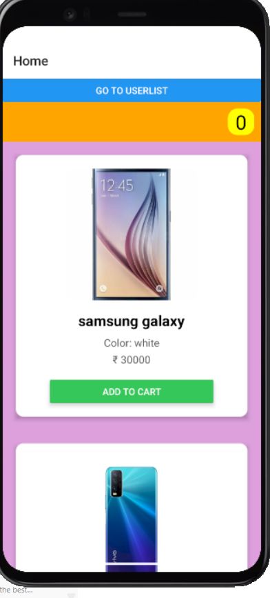
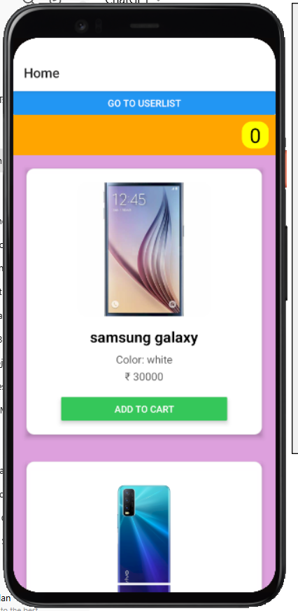
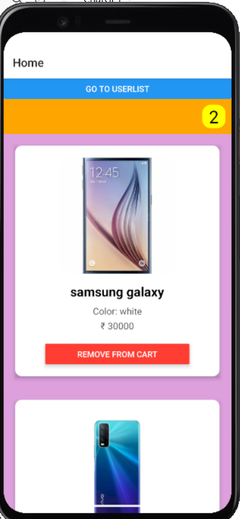
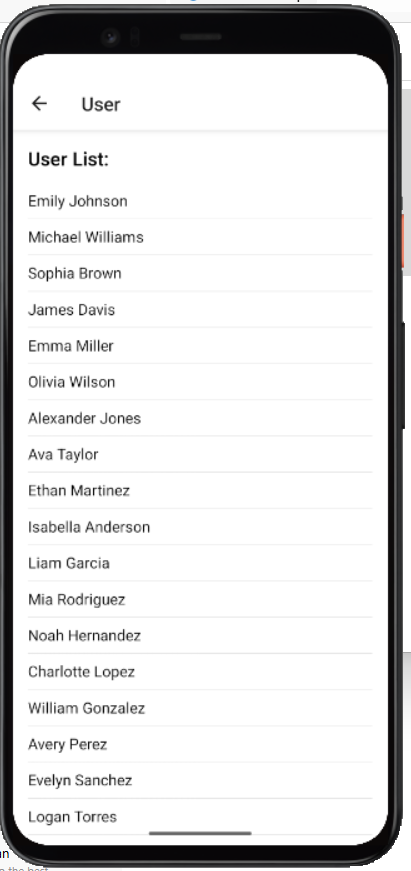

This is a new [**React Native**](https://reactnative.dev) project, bootstrapped using [`@react-native-community/cli`](https://github.com/react-native-community/cli).


# 🛒 React Redux Cart App with Redux-Saga

This is a simple React app that demonstrates the use of **Redux** and **Redux-Saga** in action. It allows users to:
- Add and remove items from a shopping cart
- Fetch and display user data from an external API using Redux-Saga

> Built with ❤️ using React + Redux + Redux-Saga + Fetch API.

---

## 🔥 Features

- 🛍️ Add to Cart / Remove from Cart with Redux
- 👥 Fetch Users from [`https://dummyjson.com/users`](https://dummyjson.com/users) using Redux-Saga
- 🔄 State Management using Redux
- 🧠 Middleware logic with Redux-Saga
- 📦 Lightweight and easy to understand structure

---

## 📸 App Screenshots

### 🧾 Home Screen


### 🛒 Cart Screen


### 👤 Cart List


### 🧰 User Detail



## 🚀 Getting Started

### 1. Clone the repo

```bash
git clone https://github.com/PremmChand/AwesomeProject.git
cd your-repo-name


> **Note**: Make sure you have completed the [Set Up Your Environment](https://reactnative.dev/docs/set-up-your-environment) guide before proceeding.

## Step 1: Start Metro

First, you will need to run **Metro**, the JavaScript build tool for React Native.

To start the Metro dev server, run the following command from the root of your React Native project:

```sh
# Using npm
npm start

# OR using Yarn
yarn start
```

## Step 2: Build and run your app

With Metro running, open a new terminal window/pane from the root of your React Native project, and use one of the following commands to build and run your Android or iOS app:

### Android

```sh
# Using npm
npm run android

# OR using Yarn
yarn android
```

### iOS

For iOS, remember to install CocoaPods dependencies (this only needs to be run on first clone or after updating native deps).

The first time you create a new project, run the Ruby bundler to install CocoaPods itself:

```sh
bundle install
```

Then, and every time you update your native dependencies, run:

```sh
bundle exec pod install
```

For more information, please visit [CocoaPods Getting Started guide](https://guides.cocoapods.org/using/getting-started.html).

```sh
# Using npm
npm run ios

# OR using Yarn
yarn ios
```
Made with ❤️ by [Premm Chand] - Feel free to reach out for contributions or feedback!